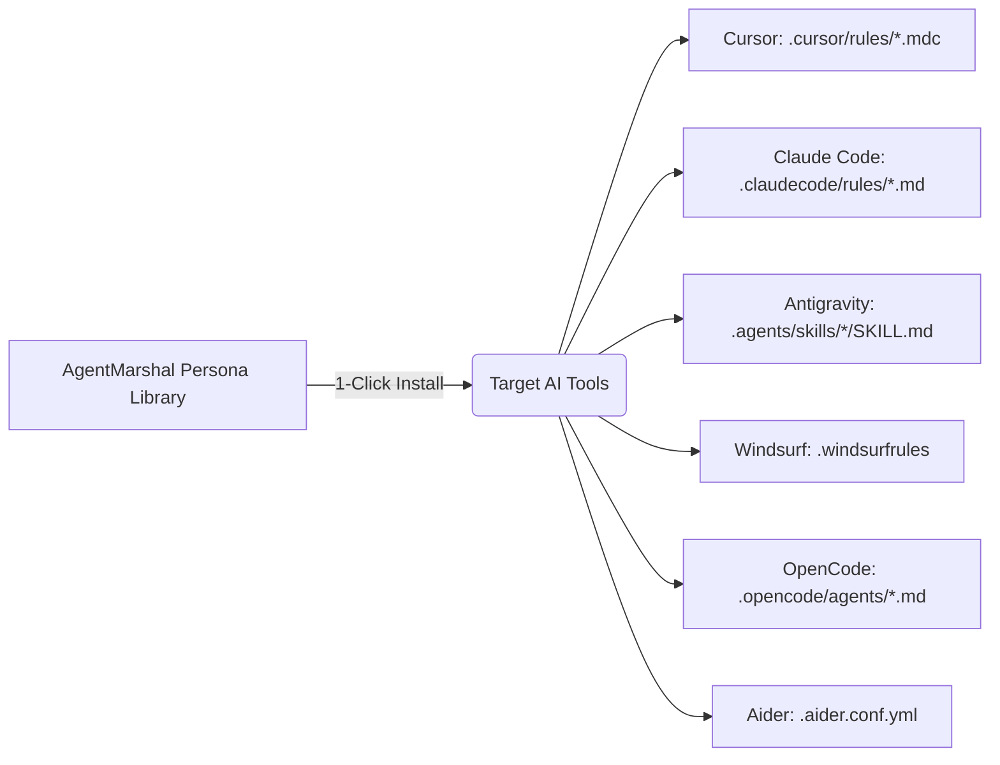

# AgentMarshal | Open-Source Multi-Agent AI Agency & Installer

[](https://www.rust-lang.org/)
[](https://tauri.app/)
[](https://react.dev/)
[](https://sqlite.org/)
[](LICENSE)
[](https://github.com/RoyalLit/AgentMarshal)

**AgentMarshal** is an open-source, cross-platform (macOS, Windows, Linux) multi-agent orchestration engine and desktop application. Modeled after [`msitarzewski/agency-agents`](https://github.com/msitarzewski/agency-agents), it brings a complete digital agency of **125+ specialized AI coding personas** into your AI development environments (**Cursor**, **Claude Code**, **Antigravity**, **Windsurf**, **OpenCode**, and **Aider**).

---

## 🌟 Vision & Value Proposition

Generic AI prompts produce generic code. **AgentMarshal** replaces vague AI interactions with specialized, role-governed personas (Backend Architects, AppSec Engineers, UX Architects, AEO Search Optimizers, Reality QA Checkers) that operate under strict input/output contracts and exclusive path concurrency guardrails.

### Key Value Pillars

- **🏛️ 125+ Specialized AI Personas**: 6 full departments providing tested system prompts, rule constraints, and execution workflows.
- **⚡ 1-Click Multi-Tool Installation**: Batch-install persona rule sets directly into `.cursor/rules/`, `.claudecode/rules/`, `.agents/skills/`, `.windsurfrules`, and `.opencode/agents/`.
- **🔒 Exclusive Path Concurrency Control**: Prevents multi-agent race conditions by enforcing Exclusive File/Directory Locks (`.orchestrator/state.db` in SQLite WAL mode).
- **🖥️ Native Cross-Platform Desktop UI**: Powered by **Tauri v2** and **React**, offering a lightweight, zero-bloat native GUI across macOS, Windows, and Linux.

---

## 🏛️ Agency Departments & Persona Ecosystem

AgentMarshal organizes personas into 6 core departments, covering the entire software product lifecycle:

| Department | Personas Count | Core Focus & Deliverables |
| :--- | :---: | :--- |
| 💻 **Engineering** | 52 Personas | High-throughput backend architecture, frontend design systems, mobile app development, database optimization, DevOps pipelines, embedded firmware. |
| 🔒 **Security** | 10 Personas | Threat modeling, SAST/DAST verification, OWASP Top 10 mitigation, cloud IAM security, SOC 2 compliance auditing, incident response. |
| 🎨 **Design & UX** | 9 Personas | CSS layout systems, design tokens, dark mode glassmorphism, accessibility color palettes, micro-interactions, brand identity. |
| 🚀 **Marketing & AEO** | 30 Personas | AI Engine Optimization (`llms.txt`, AI-aware `robots.txt`), ChatGPT/Claude/Gemini search citations, growth hacking, carousel generation. |
| 🧪 **Testing & QA** | 8 Personas | WCAG 2.2 accessibility audits, REST/GraphQL API test generation, empirical evidence verification, zero-hallucination sign-offs. |
| 📋 **Product & Strategy** | 16 Personas | Spec-to-user-story translation, MoSCoW sprint prioritization, decision routing, developer advocacy, custom MCP tool building. |

---

## 🛠️ Multi-Tool Installation Targets

AgentMarshal automatically parses markdown persona definitions and formats them for your target AI coding tool:



---

## 📖 Documentation Ecosystem

| Resource | Description |
| :--- | :--- |
| [**Architecture Specification**](./ARCHITECTURE.md) | Deep dive into SQLite DDL schemas, lock cascade algorithms, and `AgentAdapter` traits. |
| [**Masterplan**](./Orchestrator_masterplan.md) | Initial product vision, lock semantics, and state machine specification. |
| [**Persona Library**](./apps/desktop/src/allSubagentsCatalog.ts) | Complete index of all 125 harvested subagent personas. |

---

## 💻 CLI & Desktop Setup

### Prerequisites
- **Node.js**: 18+ (`npm` or `pnpm`)
- **Rust Toolchain** *(for native CLI/Tauri builds)*: 1.75+ (`rustup default stable`)

### Building & Running the Desktop Application

```bash
# Clone the repository
git clone https://github.com/RoyalLit/AgentMarshal.git
cd AgentMarshal/apps/desktop

# Install dependencies
npm install

# Run frontend preview
npm run dev

# Run native Tauri Desktop App
npm run tauri dev
```

### CLI Command Reference (`agentmarshal`)

```bash
# List all 125 agency personas across 6 departments
agentmarshal list

# Batch-install personas into Cursor and Claude Code
agentmarshal install --tool cursor,claude

# Install specific backend & security agents into Antigravity
agentmarshal install --tool antigravity --agent backend-architect,appsec-engineer

# Inspect active path locks and installed personas
agentmarshal status
```

---

## 🤝 Contributing

AgentMarshal is an **open-source project** and welcomes contributions! Whether you're adding new agent personas, refining rule constraints, or expanding IDE target formats:

1. Fork the repository on GitHub.
2. Create a feature branch (`git checkout -b feature/new-persona`).
3. Commit your changes (`git commit -m 'feat: add Solana Smart Contract Auditor persona'`).
4. Push to the branch (`git push origin feature/new-persona`).
5. Open a Pull Request.

---

## 📄 License

This project is licensed under the **MIT License**. See the [LICENSE](LICENSE) file for details.
